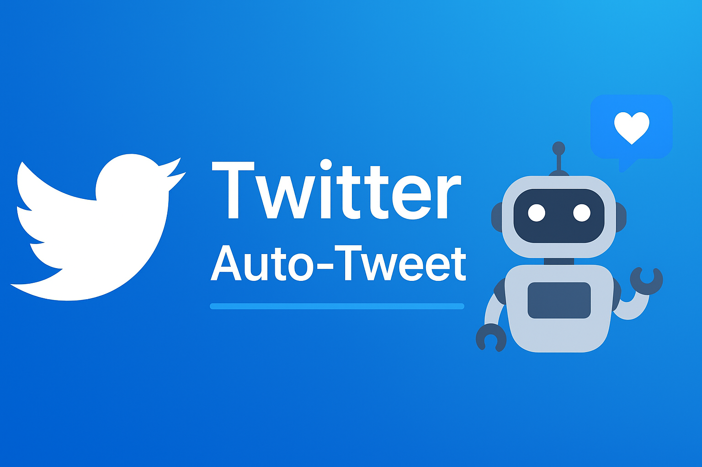

<!-- Banner -->
<p align="center">
  
</p>

<h1 align="center">🐦 Twitter Auto-Tweet Bot</h1>
<p align="center">
  <i>AI-powered social media automation for smarter, trend-driven tweets</i>
</p>

<p align="center">
  
  
  
  
</p>

---

## 📌 Overview
**Twitter Auto-Tweet Bot** is a Python automation tool that:
- 📈 Fetches **real-time trending topics** in India.
- 🤖 Generates **engaging tweets** via Google Gemini AI.
- 🗄 Logs tweets in **MySQL** to prevent duplicates.
- ⏰ Posts **automatically during peak engagement hours**.

Designed for **personal branding, marketing, and tech creators**.

---

## ✨ Features
- **Live Trending Hashtags** → Scrapes from `xtrends.iamrohit.in`.
- **AI-Powered Tweet Generation** → Tanya Arora persona for human-like tweets.
- **Scheduled Posting** → Avoids spamming, posts only at best times.
- **Duplicate Prevention** → Uses classification cache to skip reprocessing.
- **Multi-Tone Output** → Tech, casual, or empathetic based on topic.

---

## 📂 File Structure
```plaintext
twitter-auto-tweet-bot/
│
├── main.py              # Main bot loop
├── database.py          # MySQL setup & tweet saving
├── reply.py             # AI tweet generation
├── trend.py             # Trending hashtag scraper
├── twitter_client.py    # Twitter API client setup
├── requirements.txt     # Dependencies
├── token.env            # API keys (not in repo)
├── banner.png           # Project banner (for README)
└── README.md            # Project documentation
```

---

## 🛠 Installation
### 1️⃣ Clone the Repository
```bash
git clone https://github.com/USERNAME/twitter-auto-tweet-bot.git
cd twitter-auto-tweet-bot
```

### 2️⃣ Install Dependencies
```bash
pip install -r requirements.txt
pip install beautifulsoup4 mysql-connector-python
```

### 3️⃣ Set Environment Variables
Create `token.env`:
```
api_key=YOUR_TWITTER_API_KEY
api_secret=YOUR_TWITTER_API_SECRET
access_token=YOUR_ACCESS_TOKEN
access_token_secret=YOUR_ACCESS_TOKEN_SECRET
bearer_token=YOUR_BEARER_TOKEN
USER_ID=YOUR_TWITTER_USER_ID
gemini_api_key=YOUR_GEMINI_API_KEY
```

---

## 🗄 Database Setup
1. Start MySQL server.
2. Update credentials in `database.py`:
```python
conn = mysql.connector.connect(
    host="localhost",
    user="root",
    password="YOUR_PASSWORD",
    database="twitter"
)
```
3. Run:
```bash
python database.py
```

---

## 🚀 Usage
Run the bot:
```bash
python main.py
```
The bot will:
1. Fetch a trending topic.
2. Generate an AI-powered tweet.
3. Post on Twitter.
4. Save details to MySQL.
5. Repeat hourly.

---

## 📸 Example Output
```plaintext
[+] Getting Trending Topics...
1. #AIRevolution (45K Tweets) URL: https://twitter.com/search?q=%23AIRevolution
Generating Reply... Topic: AI Revolution in tech world...
Tweet: The AI wave isn’t coming—it’s already here. Adapt or get left behind. 🚀
✅ Scheduled Tweet sent.
[+] Tweet saved in Database.
[+] Bot Cycle Complete. Sleeping for 1 hour...
```

---

## ⚠ Disclaimer
This project is for **educational purposes**. Automating Twitter posts can violate Twitter’s terms of service — use responsibly.

---

<p align="center">
  Made with ❤️ by <b>Rishabh</b>
</p>
